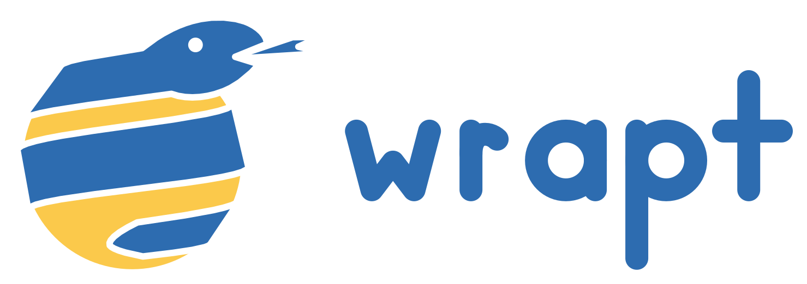

wrapt
=====

A Python module for decorators, wrappers and monkey patching.

Overview
--------

The aim of the **wrapt** module is to provide a transparent object proxy
for Python, which can be used as the basis for the construction of function
wrappers and decorator functions.

An easy to use decorator factory is provided to make it simple to create
your own decorators that will behave correctly in any situation they may
be used.

::

    import wrapt

    @wrapt.decorator
    def pass_through(wrapped, instance, args, kwargs):
        return wrapped(*args, **kwargs)

    @pass_through
    def function():
        pass

In addition to the support for creating object proxies, function wrappers
and decorators, the module also provides a post import hook mechanism and
other utilities useful in performing monkey patching of code.

The **wrapt** module focuses very much on correctness. It therefore goes
way beyond existing mechanisms such as ``functools.wraps()`` to ensure that
decorators preserve introspectability, signatures, type checking abilities
etc. The decorators that can be constructed using this module will work in
far more scenarios than typical decorators and provide more predictable and
consistent behaviour.

To ensure that the overhead is as minimal as possible, a C extension module
is used for performance critical components. An automatic fallback to a
pure Python implementation is also provided where a target system does not
have a compiler to allow the C extension to be compiled.

Documentation
-------------

.. toctree::
   :maxdepth: 1

   quick-start
   decorators
   wrappers
   monkey
   typing
   bundled
   api
   examples
   benchmarks
   changes
   issues

Presentations
-------------

Conference presentations related to the **wrapt** module:

* Advanced methods for creating decorators:

    https://www.youtube.com/watch?v=7jGtDGxgwEY

* Hear no evil, see no evil, patch no evil: Or, how to monkey-patch safely

    https://www.youtube.com/watch?v=GCZmGgtWi3M

Blog Posts
----------

Blog posts related to the **wrapt** module:

* https://github.com/GrahamDumpleton/wrapt/tree/master/blog

Workshops
---------

Guided, hands-on workshops which run in JupyterLab and check your work as
you go, with nothing to install:

* Python decorators, using only the standard library. The place to start if
  decorators are new to you, covering the ground the wrapt workshops build
  on.

    https://github.com/GrahamDumpleton/decorator-workshops

  Launch in your browser, with no account or server at all:

    https://grahamdumpleton.github.io/decorator-workshops/lab/index.html

  Launch on mybinder.org:

    https://mybinder.org/v2/gh/GrahamDumpleton/decorator-workshops/main?urlpath=lab

  Launch in GitHub Codespaces:

    https://codespaces.new/GrahamDumpleton/decorator-workshops?quickstart=1

* Three collections on wrapt itself: writing decorators with wrapt, monkey
  patching with wrapt, and object proxies with wrapt, each shown beside the
  standard library way of doing the same thing.

    https://github.com/GrahamDumpleton/wrapt-workshops

  Launch on mybinder.org:

    https://mybinder.org/v2/gh/GrahamDumpleton/wrapt-workshops/main?urlpath=lab

  Launch in GitHub Codespaces:

    https://codespaces.new/GrahamDumpleton/wrapt-workshops?quickstart=1

The README of each repository explains the launch options and how to run
the workshops locally.

Related Projects
----------------

If the monkey patching side of wrapt is what brought you here, also look at
**wrapture**. It is a sibling project built on the monkey patching
machinery of wrapt, and provides a higher level API on top of it. A clean
lifecycle and behaviour vocabulary over ``wrap_object()`` lets you point at
a method by name and stub it, fail it, transform its arguments or result,
or wrap it with a decorator, then remove it again. On top of that sit unit
testing, where the real code runs and how calls flowed through it is
recorded and asserted on, and ad-hoc tracing, where a running application
emits a structured call tree with no code changes, with export to
OpenTelemetry.

* https://github.com/GrahamDumpleton/wrapture

* https://wrapture.readthedocs.io/

Guided workshops for wrapture are available as well:

* https://github.com/GrahamDumpleton/wrapture-workshops

Installation
------------

The **wrapt** module is available from PyPi at:

* https://pypi.python.org/pypi/wrapt

and can be installed using ``pip``.

::

    pip install wrapt

Source Code
-----------

Full source code for the **wrapt** module, including documentation files
and unit tests, can be obtained from github.

* https://github.com/GrahamDumpleton/wrapt
